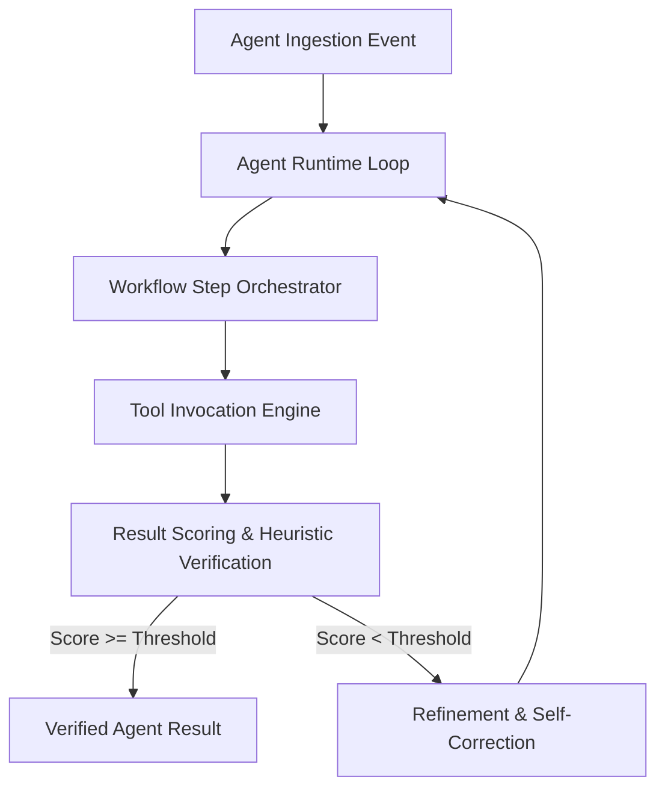

# AI Core: Autonomous Agent Runtime & Execution Loops

Modular TypeScript runtime library providing standardized abstraction layers, evaluation heuristics, scoring pipelines, and execution loops for autonomous AI agents.



## Architecture & Module Organization

AI Core acts as the centralized engine behind agentic workflows, enforcing strict data boundaries, monotonic execution tracking, and mistake-proofing contracts across microservices.

### Core Modules

- **Agent Definition (`src/agent/`)**: Strongly-typed agent state contracts, context memory stores, and instruction boundary schemas.
- **Execution Loops (`src/loops/`)**: Deterministic step evaluation loops implementing bounded iteration limits, timeout ceilings, and circuit breakers.
- **Scoring Engine (`src/scoring/`)**: Multi-dimensional output evaluation assessing syntactic validity, semantic relevance, and confidence metrics.
- **Workflows (`src/workflows/`)**: Composable directed acyclic graph (DAG) pipelines orchestrating multi-step task execution.

## Technology Stack

- **Language**: TypeScript 5.2+ (Strict Mode)
- **Runtime**: Node.js 20+ / Bun
- **Packaging**: Standard ESModule / CommonJS dual builds

## Getting Started

```bash
# Install dependencies
npm install

# Build TypeScript sources
npm run build

# Run test suite
npm test
```
